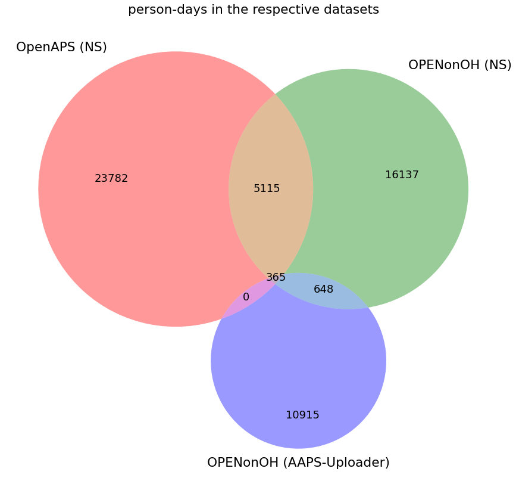
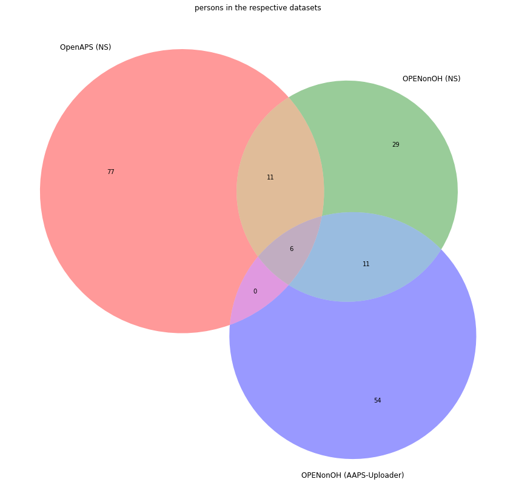
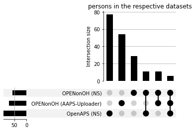
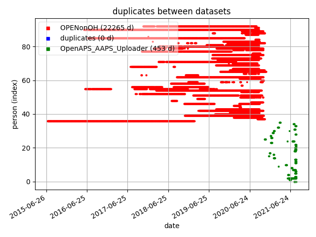
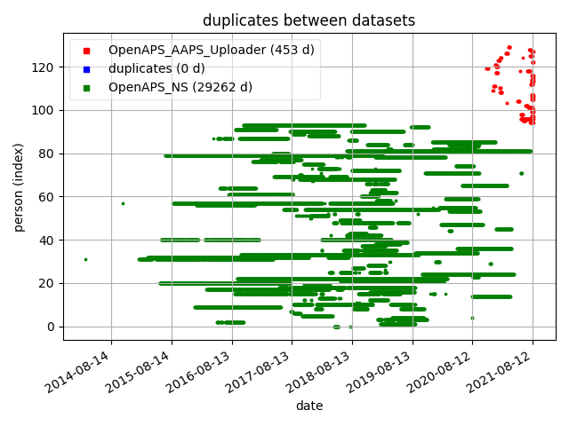
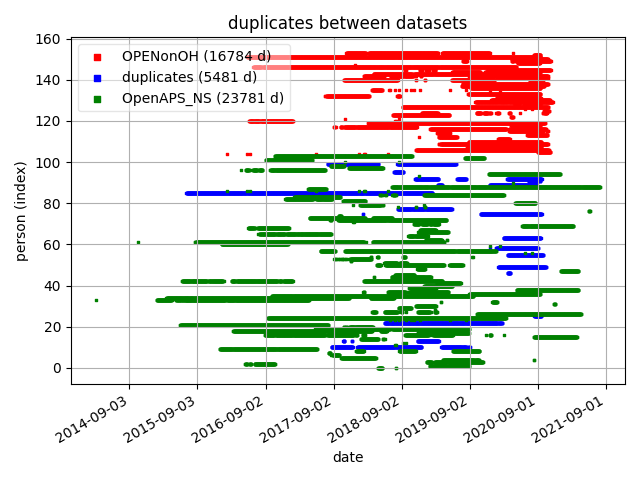

```
start date: 14.4.2022 (European date format)
last edit: 14.4.2022
author: Bernd Reinhold
```
# OPEN dataset visualisation
visualisation of the dataset sizes and duplicates in the specific use case of the [OPEN diabetes project](https://open-diabetes.eu/).

_This is ongoing work, not a final result._

## links
- [README.md](README.md) (pairwise duplicates)
- [README2.md](README2.md) (general pipeline)

## 1. self-duplicates removal (per dataset)
A considerable number of duplicate (day-user-id)-pairs in each dataset alone was found:
```
OPENonOH: 27831 days
OPENonOH without duplicate (date, user_id): 22265 days
OpenAPS_NS: 32351 days
OpenAPS_NS without duplicate (date, user_id): 29262 days
OpenAPS_AAPS_Uploader: 855 days
OpenAPS_AAPS_Uploader without duplicate (date, user_id): 453 days
OPENonOH_AAPS_Uploader: 19320 days
OPENonOH_AAPS_Uploader without duplicate (date, user_id): 11928 days
```
Certain day/user-id pairs were more than 2 and up to 8 times in the respective datasets.
Each entry was kept only once and the others were removed before proceeding further.

## 2. Venn Diagrams



## 3. [UpSetPlot](https://pypi.org/project/UpSetPlot/)s



## 4. Plots: person_count vs. date (pairwise)





