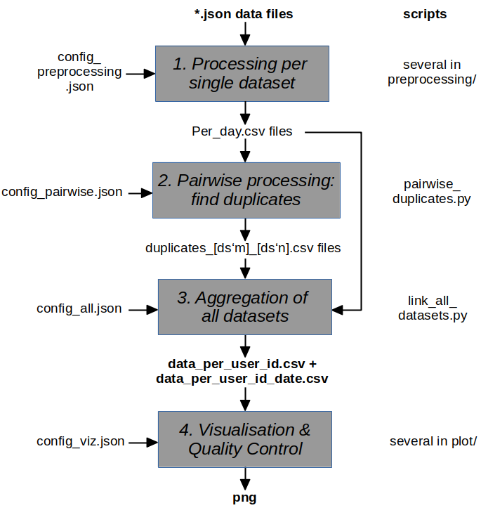

```
start date: 20.01.2022 (DD.MM.YYYY)
last edit: 06.07.2022
```
# README.md for finding duplicates in 

## links
- [README2.md](README2.md) (general pipeline)
- [OPEN_visualisations.md](OPEN_visualisations.md)

## usage (simulation)
in order to run the simulation producing artificial data apply the following steps:
1. open *config_master_sim_4ds.json* and adjust *root_data_dir_name* and *root_software_dir_name*
2. ```python3 generate_config_json.py config_master_sim_4ds.json config```
3. ```python3 generate_bash.py config_master_sim_4ds.json```
4. ```./master_script.bash```

### results/ output
- check the plots produced in the output dir: ```\[*root_data_dir_name*\]/img/```
- a considerable amount of info is printed to screen, including some warnings.  

### advantages
running the simulation has several advantages over running it on real data:
- it is self-contained, there are no external dependencies, all necessary information is in this repository
- real data requires preprocessing and format adaptions on a case-by-case basis.
- it allows anybody to familiarize her/himself with the code, below tips and hints on adjusting it to ones personal dataset are provided.

## naming
a person that donated days of its data can have done so to more than one dataset and uploader
dataset represents here a dataset-uploader pair.
In each dataset-uploader pair a person is represented by a separate project member id.

Clarify double meaning of dataset in our context: 
- at a very basic data science level here in this package a dataset is represented by its data structure. The data structure is also dependent on the uploader (nightscout vs. AAPS uploader) 
- on a higher level the uploader (nightscout or AAPS Uploader) is not relevant for the underlying data hosted on OpenAPS or Open Humans, thus instead of 4 datasets, there are only 2 datasets (which come each in two different dataformats)

- very generic and in the simulation part 


## process flow
- in the config files only the root data dir is needed, not the git repository's dir.
- when going through the sequence of steps, intermediate output files are being generated with a hardcoded name. The workaround is to change the root_data_dir_name for e.g. simulated and real data.
### conventions
- the individual datasets are a list
- the duplicate datasets are a dictionary with key "first_dataset_index-second_dataset_index"
- the machine-readable label in ```["ds0/", "ds0_per_day.csv", "dataset 0", "ds0"]``` (index: 3) is also the prefix in the filename and the sub-directory, however the code does not break if this is changed.


(generated from [process_flow.odp](doc/process_flow.odp))

The config.json files are also a good start to see the workflow and the sequence of steps to be taken. See e.g. [io.json](config/io.json) and [config_master.json](config/config_master.json).

## background
- it should scale to an arbitrary number of datasets
- you provide constraints through criteria on: 
    - how to determine duplicates (see pairwise)
    - subselections
- the duplicate logic is applied in step 2 with some preparation work in step 1. If the duplicate logic is to be changed, revisit step 2.
- additional filters can be applied by doing inner joins with project_member_id lists on the data_per_project_member_id.csv. A subset of people had donated their data via Open Humans as well as participated in a questionnaire (_link?_). A list of project member IDs of these people was used to study their data separately. This subset was selected via inner join between the list of project member IDs with the `data_per_project_member_id.csv` and `data_per_project_member_id_days.csv`. See `OPEN_visualisations_whitelist.md`.

## 0. preparation

### folder structure

- **csv_per_measurements** contains files, where one entry corresponds to one measurement of the sensor/device, etc.
- **csv_per_day** contains files, where one entry corresponds to the aggregate per day

The folder structure is created in the scripts, if they do not yet exist.

The new folder structure (as of May 2022):
- a root data directory, relative to which all directories are located
- a per_day-directory
- a duplicates-directory
- a csv_per_measurement-directory

the input datasets are labeled in the [config_master.json](config_master.json) as ds0,ds1, ..., dsn.

## 1. processing per single dataset


## 2. pairwise processing: finding duplicates
### duplicate logic
## 3. aggregation of all datasets
in link_all_datasets.py
```python
    a project_member_id_list can be specified in the config_all.json file (config_all.json is created via generate_config_json.py and can then be adjusted by the user)
    lads.project_member_id_list_as_filter(lads.out_df_pm_id_only, "pm_id")
    lads.project_member_id_list_as_filter(lads.out_df_pm_id_date, "pm_id_date")
```
## 4. visualisation & quality control


## 1. preprocessing step: `python3 preprocessing.py` (per dataset)
_In the config files the input are the per_day.csv files. Not quite consistent_

preprocessing.py takes the json.gz files of OPENonOH_Data, gunzips them to json-files and selects **noise, sgv, date, dateString** and writes them into csv-files in the _csv_per_measurement_-subdirectory.
 
_Possible improvement: only a subset of all variables is stored in the csv-output files, store all variables._

One entry in the csv output file is one measurement. One file corresponds to one json file. 

_Maybe one could also share these csv-files in the google drive?_

Some statistics on the output is provided in [csv_statistics_count_days.txt](csv_statistics_count_days.txt): Total: more than 8 Million measurements

This brings the different formats into one common format: csv file with noise, bg, date, dateString.

## 2. aggregation_step.ipynb: aggregate into statistics per days: mean, rms (or stddev), min, max, count (per dataset)
Read the csv-files in csv_per_measurement as input.
Output is one csv-file containing approx. 8000 lines, with the aggregate per days and statistical variables.
(The aggregation per day is a somewhat arbitrary choice. Since one has up to 285 measurements per day, the error on the statistical measures becomes small. For higher granularity the statistical error becomes bigger, increasing the likelihood of false positive duplicates. Aggregate per week would be possible as well.)

_Paths need to be adjusted to your local environment._

## 3. self-duplicates (per dataset)


## 4. pairwise duplicates: combine with the OpenAPS data file in a smart way.


Basic idea: if the statistical variables per day are very __"similar"__ in both datasets (OpenAPS and OPENonOH), then these are duplicate candidates. A distance metric to define __"similar"__ needs to be worked out.

The algorithm to detect duplicates applied here is a join by date between the Open Humans and the OpenAPS data commons dataset and then calculating the quadratic difference between the daily mean(plasma glucose), stddev, min, max and requiring a certain threshold.
A requirement here is that datetimes are consistent in both datasets, otherwise the daily mean, stddev, min, max are different even if the underlying data is identical except for the offset in time. An offset in time could lead to false negatives. This is achieved by calculating a UTC time from the unix_timestamps ("date"-column) and taking the date from that UTC timestamp.

False positives could arise if the threshold is chosen too loose.  

_Paths need to be adjusted to your local environment._

Here use the generic dataset_1,_2,_3 rather than the specific OpenAPS_NS (nightscout), OPENonOH, in the processing.
Because for duplicates it just matters, that they are distinct datasets, while in the previous steps the different format specific to each dataset was relevant.

## testing
A procedure is to be put in place to generate artificial per_day csv files from a matrix expressing the relationship between different datasets.
It allows to test the pipeline from step 2 to step 4. Validating the logic of generating the data_per_project_member_id.csv files.
As of May 2022 this deduplication framework is developed with four datasets. The testing allows to validate the generalization of the pipeline to more than four datasets.

## naming conventions
following: https://pythonguides.com/python-naming-conventions/

- functions and variables: snake case
- classes: camelCase, starting with a lowercase letter

## Datasets

### OpenAPS Data Commons
- Compressed: 9.6 GB
- Uncompressed: ~120 GB (!) 

## tested with
- python 3.8.10
- see requirements.txt

## dependencies
```
pip3 install -r requirements.txt
```
(requirements.txt was generated with `pipreqs .` + some manual adjustment)


```
first author: Bernd Reinhold
```

