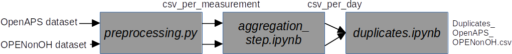

```
start date: 14.4.2022 (European date format)
last edit: 14.4.2022
author: Bernd Reinhold
```
# README too - README2.md describes the global pipeline

## links
- [README.md](README.md) (pairwise duplicates)
- [OPEN_visualisations.md](OPEN_visualisations.md)

## process flow



Assuming you have four datasets that you want to process and find duplicates in.
Here dataset is used in two ways:
- dataset or
- dataset/uploader

(explain a bit more)
## 1. self-duplicates removal (per dataset)

## 2. find pairwise duplicate entries in datasets
see [README.md](README.md)

input: json-files from the various dataset/uploader 

output: csv file duplicates_dataset1_dataset2.csv
Here dataset1 is e.g. OpenAPS_NS a dataset
## 3. table with one entry per day/user-id-pair and table with entry per user-id (all datasets)
These two tables are calculated together.
They represent the relationship between different user-ids on a per-user-id- and per-user-id/day-level across different datasets. They do not contain data themselves.


## 3a. additional filters
Additional filters can be introduced via lists of user_ids. These lists are used to filter the content of the two tables above via "inner joins".
## 4. [visualisations](OPEN_visualisations.md)
- The two tables from above can then be used to visualize the relationship between the datasets.
- Venn-diagrams or [Upset plots](https://pypi.org/project/UpSetPlot/) are used.
- Then there are plots showing at a "person_counter vs. date"-level the pairwise duplicates.

- Use upsetplot_venn3.ipynb, which in turn uses the config_viz.json, which has been generated with generate_config_json.py from the config_master_sim.json.
This is a Jupyter notebook, which is more interactive and where you have to select individually whether you want to produce plots "per_pm_id" (per project member id) or "per_pm_id_date" (per project member id or date).
- Then there is pairwise_plot.py to produce the plots person_id vs. days. It also uses config_viz.json

## Other
### user_id, person_id, person_counter
Explain the usage of different but closely related variables to identify persons and users in data.

### FAQ
- if you need to implement new ways of determining duplicates, then do it as part of [section 2](#2-find-pairwise-duplicate-entries-in-datasets)
- if you want to add new datasets, you have to adjust the whole chain.

## AID: automatic insulin delivery
- the OPENonOH data analysis focuses on persons that are using AID systems.
- therefore the OPENonOH data for the AAPS Uploader and the nightscout uploader are analysed for the following keyword: "" ("enacted" could )
- Days with these keywords are considered days, where the user was using AID. 
- data_json_2_csv.py is used to extract the AID data from the json files and to create the csv files: ```/home/reinhold/Daten/dana_processing/OPENonOH_AAPS_Uploader_Data/per_measurement_csv_AID```
- ```preprocessing/OPENonOH_NS_devicestatus.csv``` was created via: ```:~/Daten/dana_processing/n=101_OPENonOH_07.07.2022$ find . -iname "devicestatus*" -exec ls -l {} \; | awk '{print $5, $NF}' | sort -n``` followed by some manual editing in libreoffice calc
and correspondingly for ```preprocessing/OPENonOH_NS_entries.csv```: ```reinhold@Eddimed-lnx01:~/Daten/dana_processing/n=101_OPENonOH_07.07.2022$ find . -iname "entries*" -exec ls -l {} \; | grep -v "parts" | awk '{print $5, $(NF)}' | sort -n``` plus manual editing

- the files in the csv file are prefixed with the project member id (pm_id) and saved to ```/home/reinhold/Daten/dana_processing/jsonsplit_OPENonOH_NS_Data```
- there they are processed and files bigger than 50 MB are split into smaller files 


- introduced an additional step of flatening the file structure of the json files before data_json_2_csv.py. Needs to be adapted in the glob search strings.
- check_json.py
- the json files of the AID data are completely separate from their BG counter parts. Inside data_json_2_csv.py they can be considered as separate classes.
- person_counter as opposed to person_id, as it is just a counter and not a unique identifier

## Equations

$$
\text{sym\_diff}_{x}(\text{ds}_i,\text{ds}_j) = 2\cdot\frac{x_{\text{ds}_i} - x_{\text{ds}_j}}{x_{\text{ds}_i} + x_{\text{ds}_j}}\quad\quad\text{for x in mean, stddev, min, max, count and}\quad\quad \text{i,j in range(number of datasets)}
$$