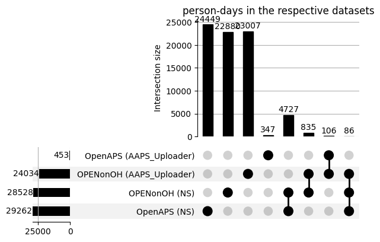
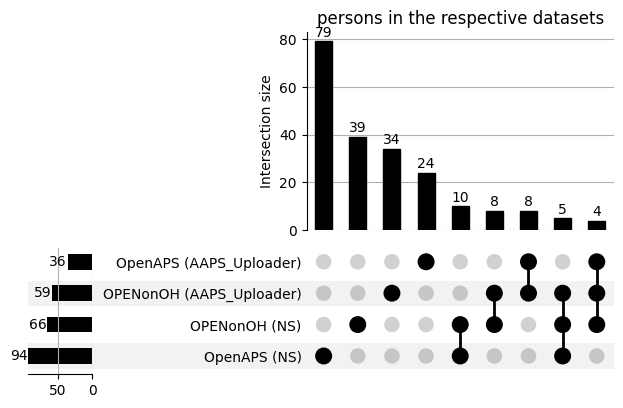
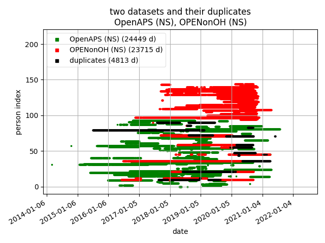
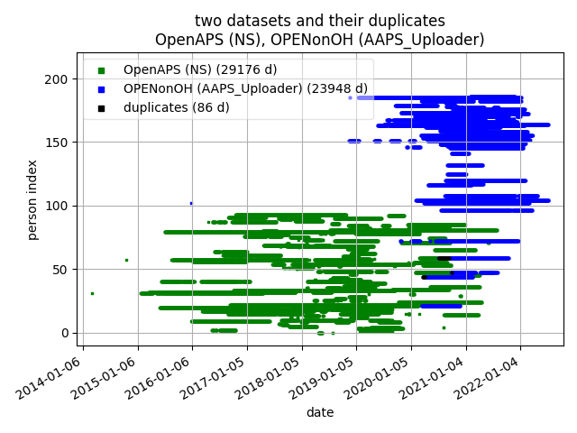
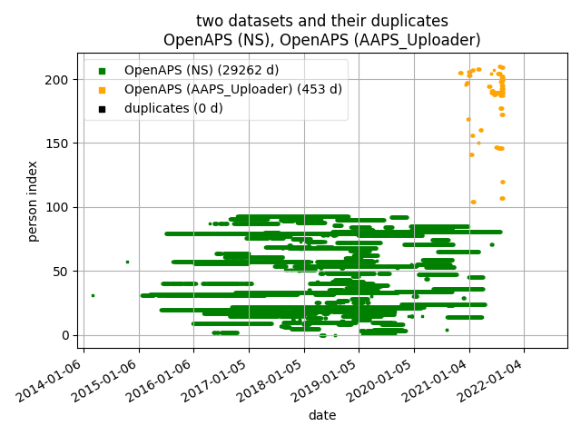
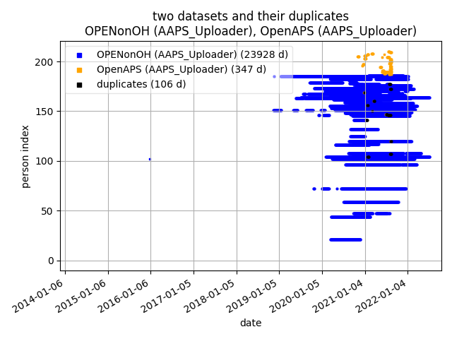
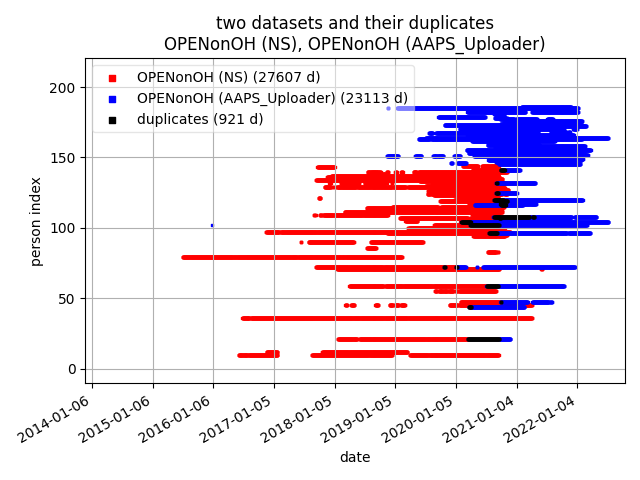
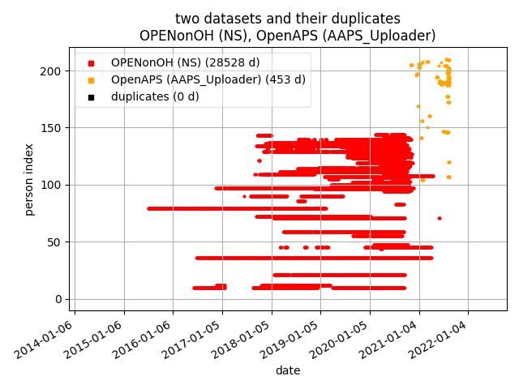
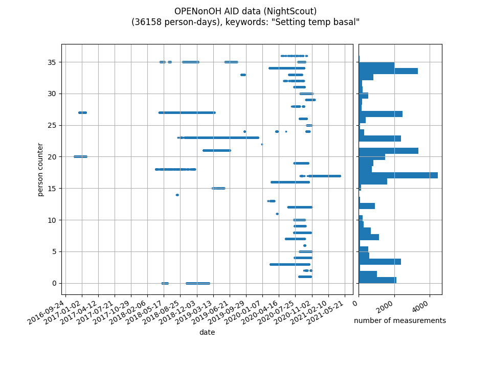
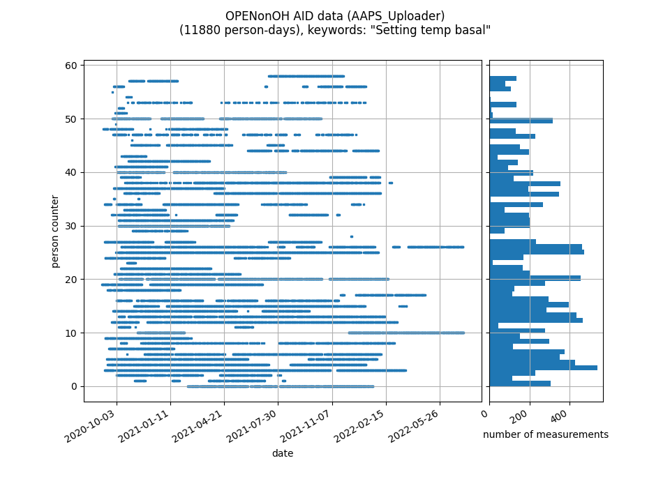

```
start date: 18.9.2022 (European date format)
last edit: 19.9.2022
```
# Results and Visualisations
visualisation of the dataset sizes and duplicates in the specific use case of the [OPEN diabetes project](https://open-diabetes.eu/).
## datasets
- n=101_OPENonOH_07.07.2022.zip
- n=183 OpenAPS Data Commons August 2021 UNZIPPED

with two uploaders each: Nightscout (NS) and AndroidAPS Uploader (AAPS_Uploader) 

## statistics
| project member ID | dataset | days | persons |
|:--------:|:-------------:|------:|---------:|
| pm_id_0 |  OpenAPS_NS | 29262 |  94 |
| pm_id_1 | OPENonOH_NS | 28528 |  66 |
| pm_id_2 | OPENonOH_AAPS_Uploader | 24034 |  59 |
| pm_id_3 | OpenAPS_AAPS_Uploader| 453 |  36 |

(Certain day/user-id pairs were more than 2 and up to 8 times in the respective datasets.
Each entry was kept only once and the others were removed before proceeding further.)

## raw data csv files
### Plasma Glucose (PG)
- [data_per_pm_id.csv](data_per_pm_id.csv)
- [data_per_pm_id_date.csv](data_per_pm_id_date.csv)
### Automatic Insulin Delivery (AID) data
- [AID_data_per_pm_id.csv](AID_data_per_pm_id.csv)
- [AID_data_per_pm_id_date.csv](AID_data_per_pm_id_date.csv)

## Plasma Glucose [UpSetPlot](https://pypi.org/project/UpSetPlot/)s



[Original article on UpSet plots](https://ieeexplore.ieee.org/stamp/stamp.jsp?tp=&arnumber=6876017)

## PG Plots: person incremental counter vs. date (pairwise dataset plots)







Both the date range of the x-axis and the person index on the y-axis are the same across all pairwise dataset plots.

## AID Plots: person incremental counter vs. date (pairwise dataset plots)




## days per person (per dataset)


## links
- [README.md](../README.md) (pairwise duplicates)
